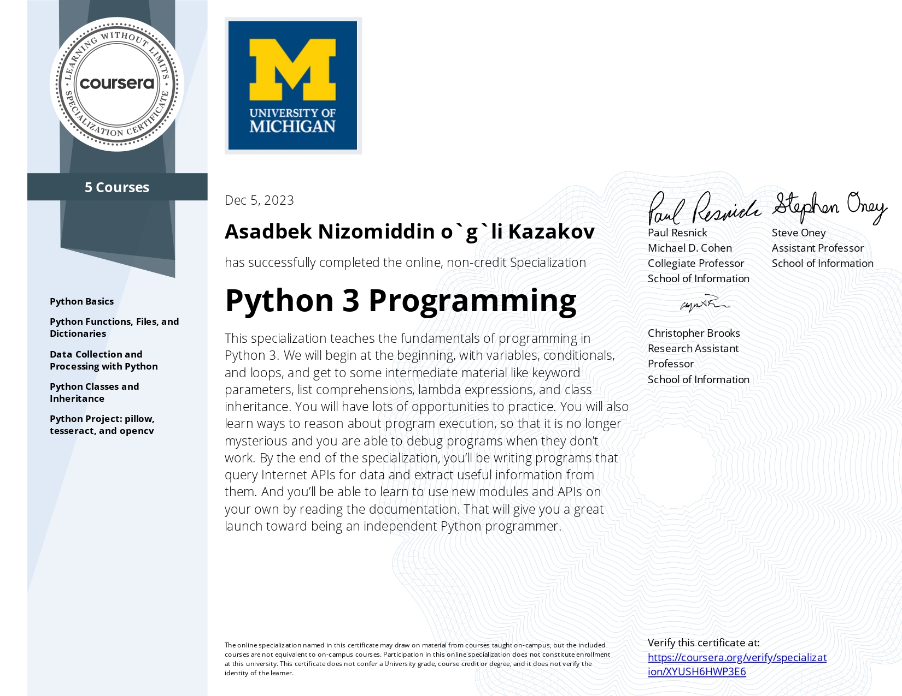

<!-- - 👋 Hi, I’m Asadbek Kazakov
- 👀 I’m interested in problem solving
- 🌱 I’m currently learning Python Backend
- 📫 How to reach me https://t.me/A_Kazakov_22 -->
# 💫 About Me:
 👋 Hi, I’m <b>Asadbek Kazakov</b>
 👀 I’m interested in <b>Problem Solving</b>
 🌱 I’m currently learning <b>Python Backend</b>
 📫 How to reach me <a href="https://t.me/A_Kazakov_22"><b>Telegram</b></a> or <a href="https://github.com/AsadbekKazakovDev"><b>GITHUB</b></a>
  

 
 

 
# 🐍 snike 

## 🌐 Socials:

🪐 You can reach me via the following links:

   
   &nbsp;
   
   &nbsp;
   
   &nbsp;
   
   &nbsp;
   
   &nbsp;
   

<!---
AsadbekKazakovDev/AsadbekKazakovDev is a ✨ special ✨ repository because its `README.md` (this file) appears on your GitHub profile.
You can click the Preview link to take a look at your changes.
--->
