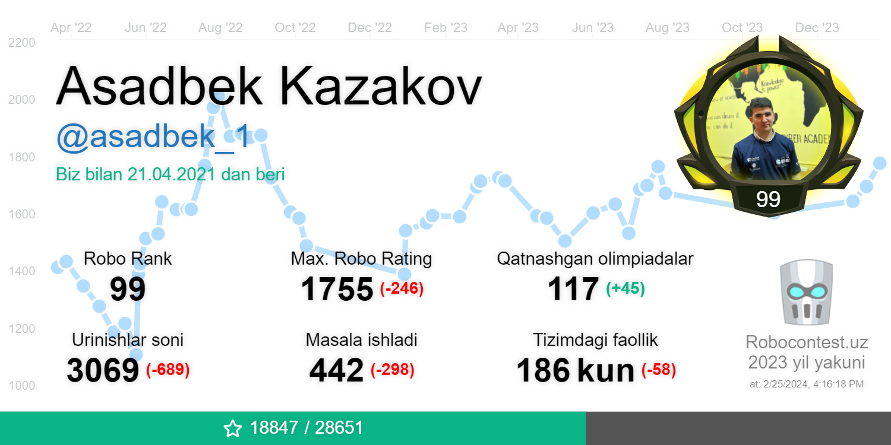
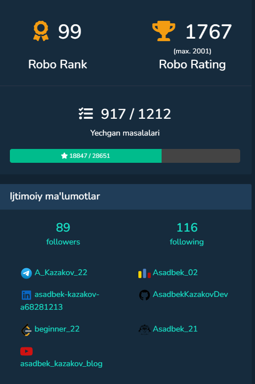
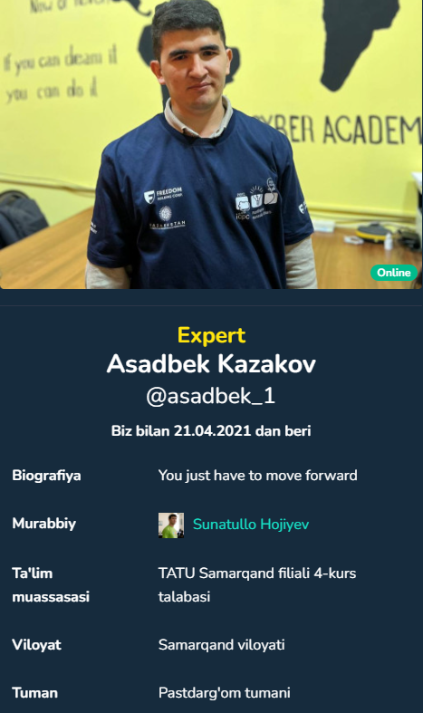

<!-- - 👋 Hi, I’m Asadbek Kazakov
- 👀 I’m interested in problem solving
- 🌱 I’m currently learning Python Backend
- 📫 How to reach me https://t.me/A_Kazakov_22 -->
# 💫 About Me:

 👋 Hi, I’m <b>Asadbek Kazakov</b>
 👀 I’m interested in <b>C++ and Python Problem Solving</b>
 🌱 I’m currently learning <b>Python Backend</b>
 📫 How to reach me <a href="https://t.me/A_Kazakov_22"><b>Telegram</b></a> or <a href="https://github.com/AsadbekKazakovDev"><b>GITHUB</b></a>
  

 

 
  Visitors count 
  

 

 
# 🐍 snike 

## 🌐 Socials:

🪐 You can reach me via the following links:

   
   &nbsp;
   
   &nbsp;
   
    &nbsp;
   
   &nbsp;
   
   &nbsp;
   
   &nbsp;
   
    &nbsp;
   
   &nbsp;
   
    &nbsp;
   
   &nbsp;
   
   &nbsp;
   
   &nbsp;
   

   

  

 

 
  

  

    
    
  

           
  

    
  

   
  <!-- 

 -->

<h4 align="center">
  <a href="https://github.com/AsadbekKazakovDev?tab=repositories" title="Show Repositories">🔎 Boshqa repositorylarni ko`rish 🔍</a>
</h4>
<!---
AsadbekKazakovDev/AsadbekKazakovDev is a ✨ special ✨ repository because its `README.md` (this file) appears on your GitHub profile.
You can click the Preview link to take a look at your changes.
--->
